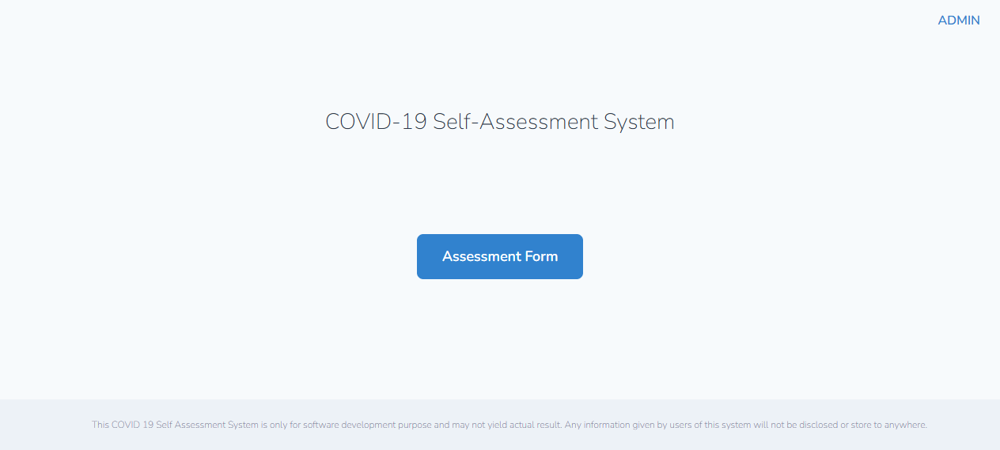
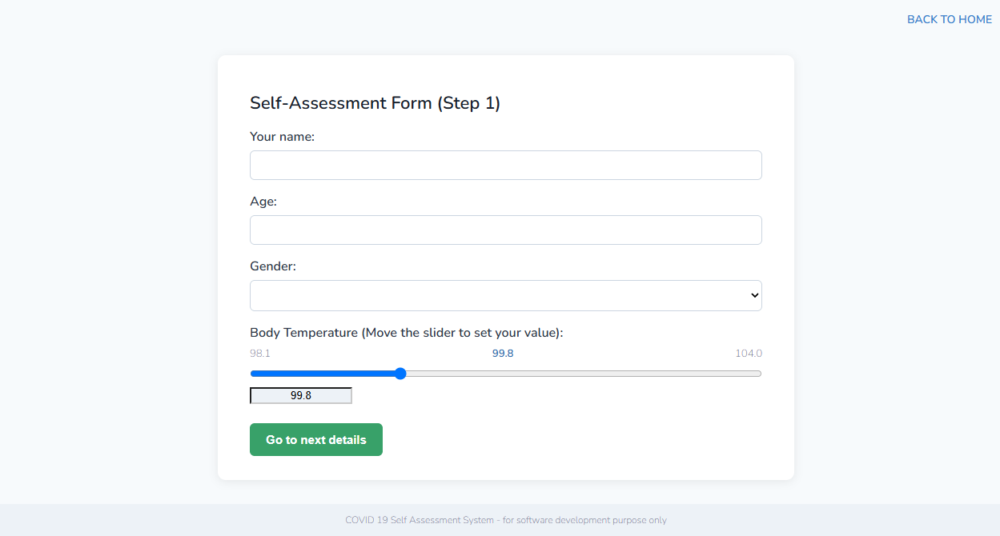
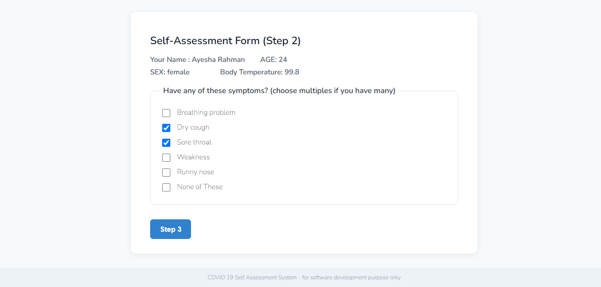
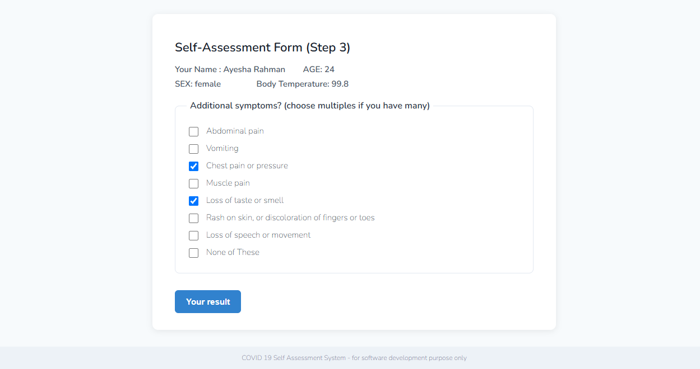
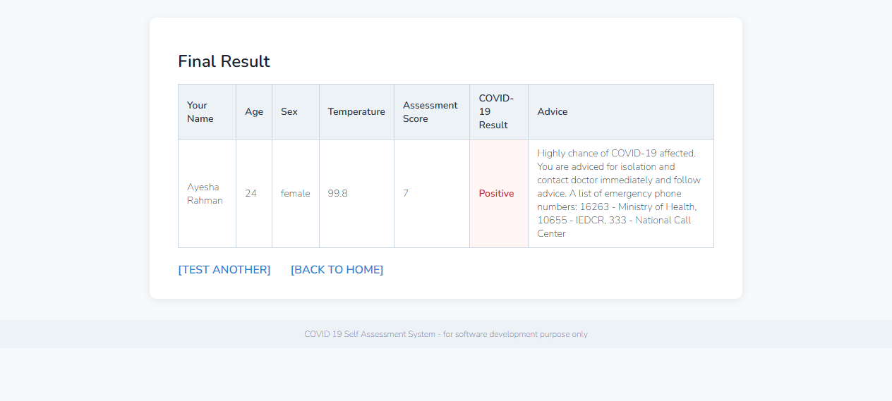
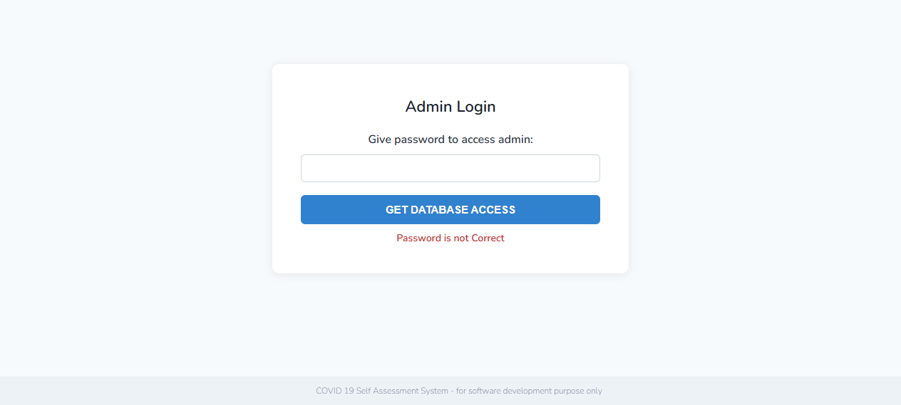
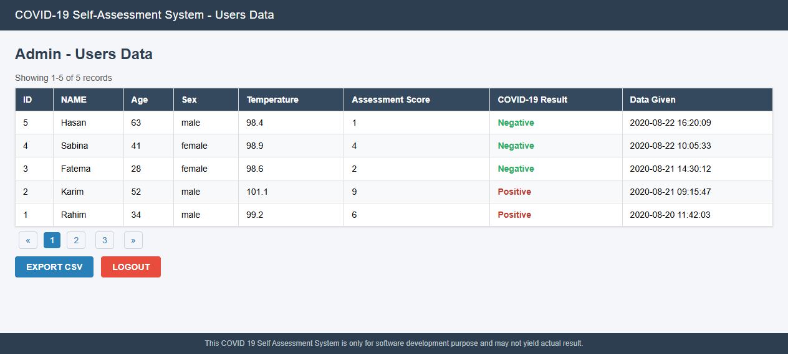

# COVID-19 Self-Assessment Web App

A web application built with **Laravel 7** and **MySQL** that lets users perform a self-assessment based on COVID-19 symptoms. The system calculates a risk score from the user's answers and provides personalised guidance on the next step — stay home, consult a doctor, or visit a hospital.

> **⚠️ Important disclaimer:** This application is built for **software development and educational purposes only**. It does **not** provide accurate medical results or diagnoses. Any information given by users is not disclosed or stored anywhere outside this demo system.

---

## Table of Contents

- [Features](#features)
- [Screenshots](#screenshots)
- [Tech Stack](#tech-stack)
- [Installation](#installation)
- [Admin Access](#admin-access)
- [Usage](#usage)
- [Project Structure](#project-structure)
- [Security](#security)
- [Contributing](#contributing)
- [Changelog](#changelog)
- [License](#license)

---

## Features

- **Multi-step assessment form** — collects personal details, body temperature, and symptoms across 3 steps
- **Automatic risk scoring** — computes a score based on symptoms and body temperature, via a unit-tested `ScoringService`
- **Personalised advice** — suggests the appropriate next step based on the computed score
- **Admin panel** — securely view all submitted assessment records (bcrypt-protected), with **pagination** and **CSV export**
- **Server-side validation** — all form inputs validated via Laravel Form Requests
- **Protected admin routes** — dedicated middleware guards against unauthorised access
- **Automated tests & CI** — PHPUnit suite (score thresholds, temperature boundaries) run by GitHub Actions on every PR

---

## Screenshots

> The screenshots below are faithful UI representations of the application rendered from its actual Blade templates.

| | |
|:---:|:---:|
| **Home Page** | **Assessment — Step 1** |
|  |  |
| **Assessment — Step 2** | **Assessment — Step 3** |
|  |  |
| **Final Result** | **Admin Login** |
|  |  |
| **Admin — Users Data** | |
|  | |

---

## Tech Stack

| Layer      | Technology               |
| ---------- | ------------------------ |
| Backend    | Laravel 7 (PHP)          |
| Database   | MySQL                    |
| Frontend   | Blade templates, jQuery  |
| Build      | Laravel Mix (Webpack)    |
| Testing    | PHPUnit (`composer test`) |
| CI/CD      | GitHub Actions (`.github/workflows/ci.yml`) |

---

## Installation

### Prerequisites

- PHP **7.4** (required by `fakerphp/faker`; Laravel 7 supports up to PHP 8.0)
- Composer
- MySQL

### Steps

1. **Clone the repository**

   ```bash
   git clone https://github.com/tawhid37/covid19webapp.git
   cd covid19webapp/covid19
   ```

2. **Install PHP dependencies**

   ```bash
   composer install
   ```

3. **Configure environment**

   ```bash
   cp .env.example .env
   php artisan key:generate
   ```

4. **Update database credentials** in `.env`

   ```env
   DB_CONNECTION=mysql
   DB_HOST=127.0.0.1
   DB_PORT=3306
   DB_DATABASE=covid19
   DB_USERNAME=root
   DB_PASSWORD=
   ```

   > **Note:** Create the `covid19` database first, or change `DB_DATABASE` to an existing database.

5. **Run migrations and seeders**

   ```bash
   php artisan migrate
   php artisan db:seed
   ```

   The seeder loads 5 sample assessment records for demonstration.

6. **Compile frontend assets**

   ```bash
   npm install
   npm run prod
   ```

7. **Start the development server**

   ```bash
   php artisan serve
   ```

   Visit `http://localhost:8000` in your browser.

---

## Admin Access

The admin panel allows viewing all submitted assessment records.

| Item       | Value                                              |
| ---------- | -------------------------------------------------- |
| URL        | `http://localhost:8000/adminpass` (via the **ADMIN** link) |
| Default password | `admin`                                   |
| Configuration | `config/covid19.php` → `admin_password_hash` (bcrypt, overridable via the `ADMIN_PASSWORD_HASH` env variable) |
| Protected routes | `GET /adminshow` + `GET /adminshow/export` behind the `admin` middleware |
| Listing | Paginated — 10 records per page with summary + links |
| CSV export | `GET /adminshow/export` streams a dated CSV of all records |
| Login rate limit | **5 attempts per minute per IP** (`throttle:5,1`) |
| Logout | `POST /logout` (CSRF-protected form) inside the `admin` route group |

> **Security:** entering the wrong password 5 times within a minute locks login for that IP for 1 minute (`429 Too Many Requests`).

To change the admin password, generate a new bcrypt hash and update `ADMIN_PASSWORD_HASH`:

```bash
php artisan tinker --execute="echo bcrypt('your-new-password');"
```

Then set the generated value in your `.env`:

```env
ADMIN_PASSWORD_HASH=$2y$10$your-generated-hash
```

---

## Usage

1. Open the home page and click **Assessment Form**.
2. Fill in your **name, age, gender, and body temperature** in **Step 1**.
3. Select any symptoms you are experiencing in **Step 2** and **Step 3**.
4. View your **risk score** and the recommended action on the result page.

### Risk Score Interpretation

| Score | Result | Advice |
| ----- | ------ | ------ |
| `0` | Negative | You are safe. Stay Home, Stay Safe. |
| `< 5` | Negative | Merely have a chance to be affected; isolation and doctor consult advised. |
| `< 7` | Positive | Possible suspected case; isolation and follow medical advice. |
| `< 8` | Positive | Highly likely affected; contact a doctor immediately. |
| `>= 8` | Positive | Almost confirmed case; hospitalisation advised. |

---

## Project Structure

```
covid19/
├── app/
│   ├── Http/
│   │   ├── Controllers/
│   │   │   └── CovidController.php       # Main application logic
│   │   ├── Middleware/
│   │   │   ├── EnsureAdminAccess.php     # Protects admin routes
│   │   │   └── SecurityHeaders.php       # Global security headers
│   │   └── Requests/                     # Form Request validation classes
│   │       ├── StoreAssessmentRequest.php
│   │       ├── StoreSymptomsRequest.php
│   │       └── StoreAdditionalSymptomsRequest.php
│   ├── Services/
│   │   └── ScoringService.php            # Unit-tested risk scoring
│   ├── Covid.php                         # Assessment record model
│   └── ...
├── config/
│   └── covid19.php                       # Admin password hash etc.
├── database/
│   ├── migrations/                       # Database schema (incl. indexes)
│   └── seeds/                            # Demo data seeders
├── resources/
│   └── views/                            # Blade templates
├── routes/
│   └── web.php                           # Application routes
├── tests/
│   └── Unit/ScoringServiceTest.php       # Scoring unit tests
└── ...
```
`.github/workflows/ci.yml` — lint + validation + tests + asset build.

---

## Security

This project has been hardened with the following measures (see the [Changelog](CHANGELOG.md) and [Code Review Report](docs/CODE_REVIEW_REPORT.md) for details):

- ✅ Admin password stored as a **bcrypt hash**, verified with Laravel's `Hash::check()` (previously insecure MD5)
- ✅ Admin routes **protected by a dedicated middleware**
- ✅ **Server-side Form Request validation** for all user input
- ✅ **HTTPS** jQuery CDN (fixed mixed-content)
- ✅ Logout **invalidates the session** and regenerates the CSRF token
- ✅ Logout is **CSRF-safe** — it is a `POST` form (with token) inside the `admin` middleware group, not a GET link
- ✅ Admin login is **rate-limited** (5 attempts/minute/IP) via Laravel's `throttle` middleware
- ✅ **Security headers** applied globally — `X-Content-Type-Options`, `X-Frame-Options`, `Referrer-Policy`, `X-XSS-Protection`, `Permissions-Policy`, plus HSTS over HTTPS
- ✅ **Session hardening** — HttpOnly + SameSite (`lax`) cookies, secure-cookie toggle via `SESSION_SECURE_COOKIE`
- ✅ SQL injection / XSS mitigated via Blade auto-escaping and parameterised queries

---

## Testing

The project ships with a **PHPUnit** suite. Run it with:

```bash
composer test
```

Current coverage:
- `ScoringServiceTest` — every score tier (`0`, `< 5`, `>= 5`) and the temperature boundaries (`99.5`–`100.9`) with 11 tests.

A **GitHub Actions** workflow (`.github/workflows/ci.yml`) runs `php -l` on every PHP file, validates `composer.json`, runs the test suite, and builds frontend assets on each push/PR.

---

## Contributing

Thank you for considering contributing! Please review the [Contributing Guidelines](CONTRIBUTING.md) before opening issues or pull requests.

---

## Changelog

See the [CHANGELOG.md](CHANGELOG.md) for a full history of changes, fixes, and releases.

---

## License

This project is open-sourced under the [MIT license](LICENSE).
